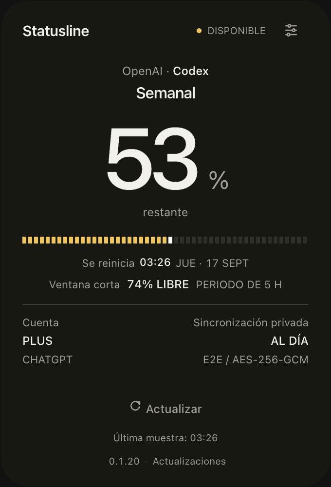
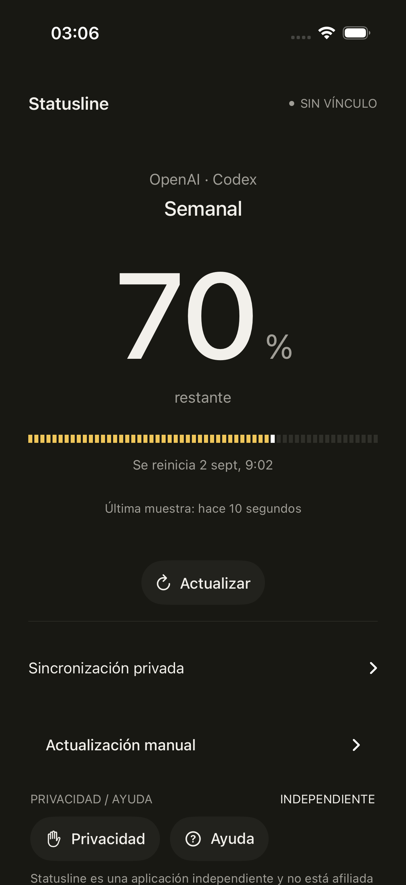
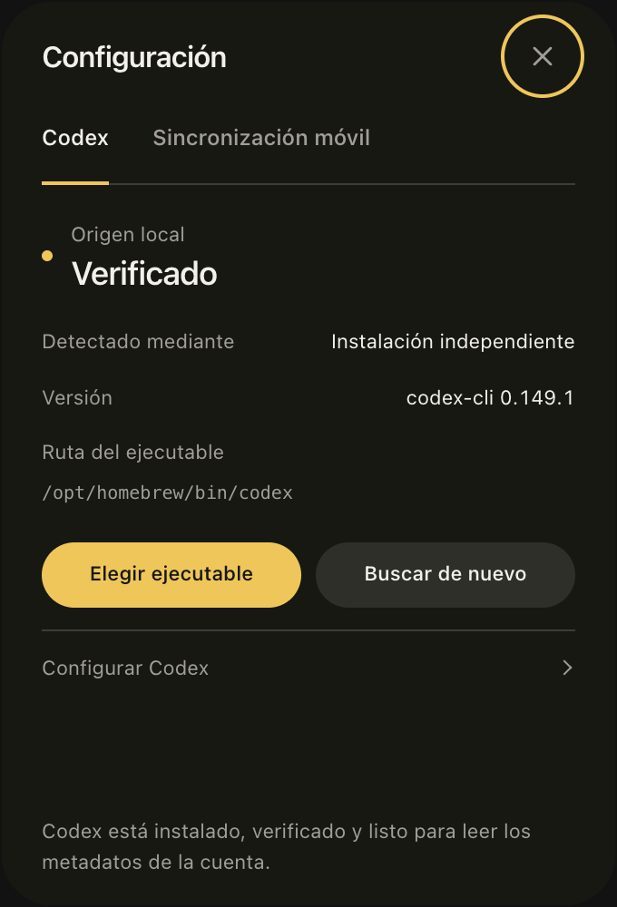
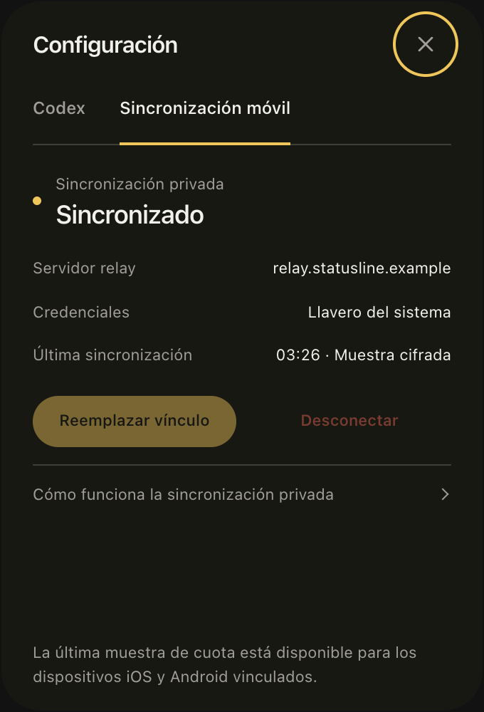
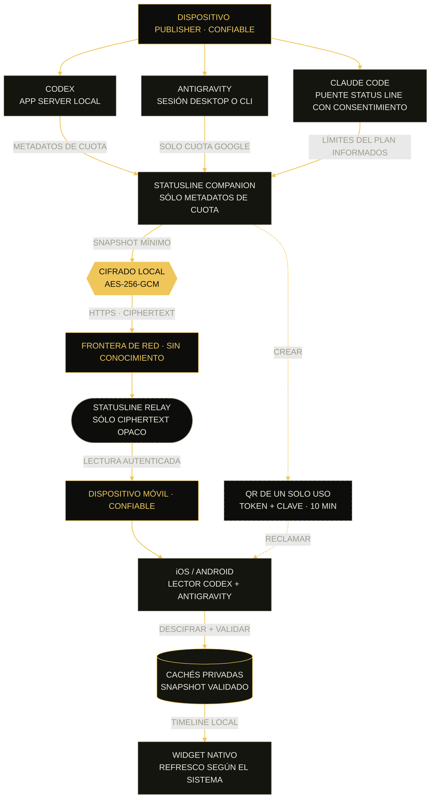

<div align="center">
  
  <h1>Statusline</h1>
  <p><strong>Las cuotas de Codex, Antigravity y Claude Code de un vistazo.</strong></p>
  <p>Un companion de escritorio. Límites separados, reinicios claros y sincronización móvil privada.</p>
  <p><a href="README.md">English</a> · <strong>Español</strong></p>
  <p><a href="https://statusline.inmerzion.io/es/"><strong>Sitio oficial</strong></a> · <a href="https://apps.apple.com/app/statusline/id6807851320">App Store</a> · <a href="https://github.com/arvivares/statusline/releases">Descargas</a></p>
</div>

<div align="center">
  <a href="https://github.com/arvivares/statusline/actions/workflows/repository-quality.yml"></a>
  <a href="https://github.com/arvivares/statusline/actions/workflows/release.yml"></a>
  <a href="https://github.com/arvivares/statusline/actions/workflows/desktop-installers.yml"></a>
  <a href="https://github.com/arvivares/statusline/actions/workflows/android.yml"></a>
  <a href="LICENSE"></a>
</div>

Statusline muestra la cuota restante y los reinicios de **OpenAI Codex, Google
Antigravity y Anthropic Claude Code** en un companion compacto para Windows,
Linux y macOS. Cambia entre los servicios detectados sin abrir cada herramienta.
Cada proveedor conserva sus propios límites y la hora de su muestra; una cuota
no disponible nunca se presenta como llena ni agotada.

La sincronización opcional cifrada de extremo a extremo lleva **Codex y
Antigravity** a las apps y widgets compatibles de iPhone y Android. La cuota de
Claude Code está disponible por ahora solo en escritorio. No necesitas los tres
proveedores ni una API key de OpenAI para usar Statusline.

> [!NOTE]
> Statusline es un proyecto open source independiente. No está afiliado, patrocinado ni respaldado por OpenAI, Google ni Anthropic.

## Proveedores compatibles

| Proveedor                   | Qué muestra el companion                                                              | Requisito local                                                                          | Apps móviles y widgets                                               |
| --------------------------- | ------------------------------------------------------------------------------------- | ---------------------------------------------------------------------------------------- | -------------------------------------------------------------------- |
| **OpenAI · Codex**          | Cuota general de Codex: ventanas semanal y corta, reinicios y plan cuando se informan | Ejecutable de escritorio compatible o CLI de Codex con sesión de ChatGPT                 | Codex; los clientes antiguos conservan la vista semanal              |
| **Google · Antigravity**    | Grupos de cuota de Google Gemini semanal y de cinco horas, cuando se informan         | Antigravity Desktop oficial o AGY CLI compatible, con sesión iniciada                    | Clientes compatibles con Codex/Antigravity y relay con `services-v1` |
| **Anthropic · Claude Code** | Límites del plan de cinco horas y siete días, solo cuando Claude Code los informa     | Claude Code CLI, consentimiento explícito en **Activar cuota** y una respuesta de sesión | Todavía no compatible                                                |

Son lecturas independientes, no un porcentaje combinado ni créditos intercambiables.
Se excluyen las cuotas de modelos de terceros en Antigravity. Algunas cuentas de
Claude informan una sola ventana; las sesiones con API key o proveedores cloud no
aportan cuota del plan y un límite de gasto de gateway no se trata como cuota restante.

Usa únicamente los servicios instalados en tu equipo. La consulta es independiente:
un servicio no disponible no sustituye la lectura de otro. Consulta las guías de
[Codex](docs/architecture/codex-sources.md),
[Antigravity](docs/architecture/antigravity-companion.md) y
[Claude Code](docs/architecture/claude-sources.md) para conocer las instalaciones
compatibles y los límites de la validación.

## Interfaz

<table>
  <tr>
    <td align="center" width="64%">
      
    </td>
    <td align="center" width="36%">
      
    </td>
  </tr>
  <tr>
    <td align="center"><strong>Companion</strong><br><sub>Demo de Codex · captura de 0.1.20</sub></td>
    <td align="center"><strong>iPhone</strong><br><sub>App nativa · demo local de Codex</sub></td>
  </tr>
</table>

**Still Signature** da protagonismo a la cuota restante: una única superficie
oscura cálida, tipografía discreta y una barra dorada segmentada con un cursor
blanco al final. El companion ocupa 340 × 500 píxeles lógicos. iPhone, Android
y los widgets nativos comparten el mismo estilo.

Estas capturas de Codex usan datos de demostración, no una cuenta personal. Se
prepararon para 0.1.20 y no muestran la nueva interfaz multiproveedor. La imagen
del iPhone procede de un simulador de iOS; los cambios de código y la publicación
en la App Store son independientes. Consulta la [procedencia y reproducción de las capturas](docs/assets/readme/README.md#still-signature-product-captures).

<details>
  <summary>Configuración del companion · Codex y sincronización móvil · ejemplos de 0.1.20</summary>
  <br>
  <table>
    <tr>
      <td align="center"></td>
      <td align="center"></td>
    </tr>
    <tr>
      <td align="center"><strong>Codex</strong></td>
      <td align="center"><strong>Sincronización móvil</strong></td>
    </tr>
  </table>
</details>

La **S** dorada segmentada es el logo oficial de Statusline. Su fuente común y las
variantes para cada plataforma se mantienen en el [kit de marca](branding/README.md).

La interfaz sigue el idioma principal del sistema: español o inglés. Para cualquier otro idioma usa inglés, también en los widgets. Consulta la [guía de localización](docs/architecture/localization.md).

El companion consulta las fuentes locales compatibles de cada proveedor; no requiere
una cuenta compartida entre el ordenador y el teléfono. Cuando activas la
sincronización, publica muestras mínimas cifradas que el relay no puede descifrar.

### Descargar para iPhone

<div align="center">
  <a href="https://apps.apple.com/app/statusline/id6807851320">
    
  </a>
  <p><a href="https://apps.apple.com/app/statusline/id6807851320"><strong>Descargar en la App Store</strong></a><br><sub>Gratis · iPhone · iOS 17 o posterior</sub></p>
</div>

Escanea con la cámara del iPhone o toca el enlace desde el teléfono. Este QR es
público y sirve para descargar la app; no es un código privado de emparejamiento.

### Android · Próximamente

**Próximamente en Google Play.** Añadiremos aquí el enlace de descarga y su QR
cuando la app esté aprobada. Los APK de la beta de Android ya están disponibles en
[GitHub Releases](https://github.com/arvivares/statusline/releases).

## Qué incluye

- Codex, Antigravity y Claude Code en una vista de escritorio; Claude requiere activación explícita.
- Ventanas propias de cada proveedor, porcentaje restante, reinicios y antigüedad de las muestras.
- Companion de bandeja/barra de menú para Windows, Linux y macOS, construido con Tauri, Rust y TypeScript.
- Avisos de nuevas versiones desde GitHub, descargas verificadas e instalación con
  confirmación; consulta el [soporte de actualizaciones](docs/architecture/companion-updates.md).
- Aplicaciones nativas para iPhone y Android con emparejamiento mediante QR o vínculo privado.
- Codex y Antigravity en apps móviles y widgets compatibles de iOS y Android,
  alimentados desde cachés privadas; los clientes antiguos siguen mostrando solo Codex.
- Relay universal con credenciales separadas de publicación, emparejamiento y lectura.
- Cifrado AES-256-GCM interoperable entre Rust, Swift y Kotlin.
- Instaladores reproducibles y verificaciones automáticas en GitHub Actions.

## Plataformas

| Plataforma                  | Rol          | Implementación   | Distribución                                                    |
| --------------------------- | ------------ | ---------------- | --------------------------------------------------------------- |
| Windows x64                 | Publisher    | Tauri + Rust     | NSIS `.exe` y MSI                                               |
| Linux x64                   | Publisher    | Tauri + Rust     | DEB, RPM y AppImage + firmas OpenPGP                            |
| macOS Apple Silicon + Intel | Publisher    | Tauri + Rust     | DMG y PKG universales                                           |
| macOS nativo                | Publisher    | SwiftUI          | Target `StatuslineCompanion` de Xcode                           |
| iPhone, iOS 17 o posterior  | Reader       | SwiftUI          | [App Store](https://apps.apple.com/app/statusline/id6807851320) |
| Widget de iOS               | Presentación | WidgetKit        | Incluido con la app de iPhone                                   |
| Android 6.0 o posterior     | Reader       | Kotlin + Compose | APK y AAB firmados                                              |
| Widget de Android           | Presentación | App Widget       | Incluido con la app Android                                     |
| Cloudflare Workers + D1     | Relay        | TypeScript       | Despliegue con Wrangler                                         |

`apps/desktop` contiene el companion multiproveedor que genera los instaladores
públicos de escritorio. El target SwiftUI `StatuslineCompanion`, dentro de
`apps/apple`, se conserva como implementación nativa de macOS centrada en Codex;
no es necesario para compilar Tauri ni equivale al companion multiproveedor.

## Releases

Las descargas permanentes se publican en [GitHub Releases](https://github.com/arvivares/statusline/releases).
La entrada actual `windows-bootstrap-v0.1.6` es una preview de Windows explícitamente sin
firma para el onboarding de SignPath Foundation; no es la beta pública para usuarios.

La versión del repositorio es **0.1.30 Beta**; consulta sus
[notas de release](docs/release/notes/v0.1.30.md). La configuración publica una
release normal de GitHub, no una Pre-release, pero el producto sigue en beta.
Incluye previews NSIS/MSI de Windows, DEB/RPM/AppImage, DMG/PKG universal y APK/AAB firmados.
Preparar los metadatos no publica los instaladores. El inventario, checksums, controles
de confianza y attestations de procedencia deben aprobarse antes de hacerla pública.
**Los instaladores Windows son previews sin firma Authenticode** mientras se completa
SignPath Foundation; sus nombres incluyen `.unsigned` y SmartScreen puede advertir o
bloquear la instalación. Los checksums firmados y la procedencia de GitHub verifican
integridad, no la confianza del editor en Windows. No desactives las protecciones de
Windows. Los artefactos de Actions son resultados temporales de QA, no releases.

Consulta el [runbook de release pública](docs/release/release-runbook.md) para ver el
inventario exacto, la configuración SignPath y los comandos de verificación.

## Roadmap

El companion de escritorio ya admite Codex, Antigravity y Claude Code con activación
explícita. Las apps y widgets móviles compatibles con Codex/Antigravity usan el
inventario cifrado de servicios sin sustituir los emparejamientos existentes.

Los siguientes pasos incluyen Claude en móviles, validación de sesiones reales de
Claude en Windows y Linux y más pruebas de paquetes instalados. El backlog incluye
un timeline de reinicios entre proveedores, historial local, alertas de capacidad,
pronósticos con confianza explícita y relay autohospedado. GitHub Copilot y otros
adaptadores siguen en investigación; no son funciones actuales.

Consulta el [roadmap completo de producto e ingeniería](ROADMAP.md) para ver factibilidad, principios de privacidad, hitos de arquitectura y definición de terminado.

## Cómo funciona



Las líneas continuas representan el refresco recurrente. El trazado punteado es la entrega de emparejamiento de un solo uso; el relay nunca recibe la clave de cifrado.

1. Colectores independientes consultan las fuentes locales compatibles: Codex App Server, la sesión seleccionada de Antigravity Desktop/CLI y el puente status line de Claude Code activado con consentimiento. Conservan metadatos de cuota, no conversaciones ni código fuente.
2. Al crear un canal, el relay entrega credenciales aleatorias de publisher y pairing; el companion genera localmente una clave AES-256.
3. El QR contiene el identificador del canal, un token de un solo uso que vence en diez minutos y la clave. No contiene la credencial publisher ni la URL del relay.
4. La app móvil cambia el token efímero por una credencial reader y conserva reader + clave en el almacén seguro del sistema.
5. El relay almacena hashes de credenciales, timestamps operativos y muestras cifradas opacas. Nunca recibe la clave de cifrado. Un relay compatible acepta el inventario de servicios junto a la muestra de Codex para clientes antiguos.
6. La app móvil autentica y descifra la muestra y actualiza su caché privada. Las apps y widgets actuales muestran Codex y Antigravity e ignoran las entradas de Claude. Los lectores antiguos conservan la muestra semanal de Codex.

El contrato normativo está en [Statusline Relay Protocol v1](protocol/statusline-relay-v1.md), con su [extensión opcional services-v1](protocol/statusline-services-v1.md) y un [vector AES-GCM compartido](protocol/fixtures/aes-gcm-v1.json).

## Uso

### 1. Preparar los proveedores que uses

#### Codex

En macOS puedes usar **Codex integrado en ChatGPT o Codex.app**, sin instalar una
CLI por separado. Instala la app de escritorio en Aplicaciones, abre Codex e inicia
sesión con ChatGPT. Statusline detecta automáticamente su ejecutable integrado.

La detección de apps de escritorio en Windows admite paquetes MSIX de OpenAI e
instalaciones convencionales. **Falta la validación en un Windows sin CLI**; consulta la
[guía de orígenes](docs/architecture/codex-sources.md#windows-desktop-discovery).

Como alternativa en macOS, Windows o Linux, instala Codex CLI y completa
**Sign in with ChatGPT**:

```shell
codex --version
codex
```

Statusline detecta instalaciones standalone, npm, Homebrew, Volta, NVM, FNM, asdf, mise y `PATH`. También permite seleccionar manualmente un ejecutable y lo verifica con `codex --version` antes de guardarlo.

Reutilizar la sesión de escritorio depende del modo de autenticación local de OpenAI.
Consulta [los orígenes de Codex](docs/architecture/codex-sources.md) para ver las rutas
compatibles en macOS y qué hacer si el ejecutable integrado pide iniciar sesión.

#### Antigravity

Instala e inicia sesión en **Antigravity Desktop** oficial o **AGY CLI**. El companion
detecta automáticamente las instalaciones compatibles y prefiere Desktop en la
primera configuración. Recuerda el origen elegido: cerrar sesión o fallar una
lectura no cambia de cuenta de forma silenciosa. **Configuración → Servicios**
permite elegir un origen avanzado o desactivar la consulta.

El adaptador CLI requiere la familia compatible de comandos de solo lectura
`/usage` (versión mayor 1, desde 1.1.11). Solo incluye los grupos de Gemini de Google
semanal y de cinco horas; consulta la [configuración y los límites de Antigravity](docs/architecture/antigravity-companion.md).

#### Claude Code

Instala **Claude Code CLI**, abre una sesión autenticada y elige **Activar cuota**
en el companion o **Conectar Claude Code** en **Configuración → Servicios**.
Es una activación explícita: Statusline añade su puente al ajuste `statusLine`
de Claude Code, conserva una status line personalizada existente y la restaura
al desconectar.

La cuota aparece después de que Claude Code informe los límites del plan en una
respuesta de sesión. Instalar solo la app de chat de Claude no basta. Las ventanas
ausentes siguen siendo desconocidas; la última muestra no garantiza uso en vivo
desde otros dispositivos o claude.ai. La validación con sesiones reales cubre macOS;
Windows/Linux tienen pruebas y fixtures, con validación real pendiente. Consulta
[los detalles del origen Claude](docs/architecture/claude-sources.md).

### 2. Instalar el companion

Descarga el formato correspondiente desde
[GitHub Releases](https://github.com/arvivares/statusline/releases) o compílalo desde el código:

- Windows: NSIS para instalación normal; MSI para despliegues administrados.
- Linux: DEB, RPM o AppImage.
- macOS: DMG para arrastrar a Aplicaciones; PKG para instalación guiada.

Los instaladores no incluyen las aplicaciones de los proveedores ni credenciales de usuario.

### 3. Emparejar el móvil

1. Confirma que el companion muestre una lectura de Codex o Antigravity. Claude todavía no se muestra en móviles.
2. Abre la configuración de sincronización móvil y selecciona **Crear vínculo**.
3. En iOS o Android, abre **Pair device** y escanea el QR o pega el vínculo privado.
4. Actualiza el companion y después la app móvil.
5. Añade el widget desde el selector del sistema.

Sincronizar Antigravity requiere un relay con `services-v1` y lectores compatibles
(implementados desde iOS 1.1.0 / Android 0.1.25). Las versiones de código no garantizan
su publicación en las tiendas. Los emparejamientos existentes siguen siendo válidos;
un cliente que solo admite Codex necesita actualizar su app para mostrar más servicios.

El QR de emparejamiento del companion debe tratarse como una contraseña durante sus diez minutos de vigencia. No lo compartas en logs, capturas o solicitudes de soporte.

## Desarrollo

### Requisitos generales

- Node.js 26.9.0 y npm 11.19.1 (herramientas de build; consulta la [política de Node](docs/architecture/node-toolchain.md)).
- Rust 1.98 mediante rustup para el companion Tauri.
- Al menos un proveedor compatible instalado y autenticado para probar datos reales;
  Claude Code requiere además activar el puente. Las pruebas sintéticas no necesitan cuenta.
- Requisitos nativos de [Tauri 2](https://v2.tauri.app/start/prerequisites/) para cada escritorio.
- Xcode actual para iOS, WidgetKit y el companion SwiftUI de macOS.
- JDK 17, Android SDK Platform 37 y Build Tools 36.0.0 para Android.
- Una cuenta de Cloudflare sólo si se desplegará una instancia propia del relay.

### Variables de entorno

El repositorio incluye una plantilla sin secretos. Para desarrollo local, cópiala y carga sus valores en la terminal desde la raíz:

```shell
cp .env.example .env
set -a
. ./.env
set +a
```

En PowerShell:

```powershell
Copy-Item .env.example .env
Get-Content .env | Where-Object { $_ -match '^\s*[^#\s][^=]*=' } | ForEach-Object {
  $name, $value = $_ -split '=', 2
  Set-Item -Path "Env:$($name.Trim())" -Value $value.Trim()
}
```

Ninguna herramienta del monorepo carga automáticamente el `.env` de la raíz.

`.env` está excluido de Git. La plantilla cubre el origen del relay, el override opcional de Codex, la firma local de Android y la autenticación no interactiva de Wrangler. El relay también incluye [`services/relay/.dev.vars.example`](services/relay/.dev.vars.example); actualmente no necesita secretos de runtime. Nunca copies API keys de OpenAI, tokens de pairing, certificados ni credenciales reales a un archivo versionado.

### Companion desktop

```shell
cd apps/desktop
npm ci
npm test
npm run check
npm run release:check
```

Para desarrollo visual sin iniciar Rust:

```shell
npm run dev
```

Vite expone previews con `?preview=ready`, `loading`, `empty` o `error`; `&panel=source` y `&panel=relay` abren las superficies de configuración.

Para ejecutar Tauri contra un relay local:

```shell
export STATUSLINE_RELAY_BASE_URL="http://127.0.0.1:8787"
npm run tauri dev
```

HTTP sólo se acepta para loopback en Debug. Los builds de producción requieren un origen HTTPS.

### Sitio de presentación

La [web independiente](apps/web/README.md) tiene como dominio de publicación
[statusline.inmerzion.io](https://statusline.inmerzion.io). Utiliza recursos locales
y demostraciones identificadas, sin un backend de relay.

```shell
cd apps/web
npm ci
npm run dev -- --port 4173
```

Antes de publicar, ejecuta `npm run check`, `npm run format:check` y `npm run build`.

### Relay

```shell
cd services/relay
npm ci
npm run db:migrate:local
npm test
npm run check
npm run dev
```

El adaptador operativo usa Cloudflare Workers + D1. Para desplegar una instancia:

```shell
npx wrangler d1 create statusline-relay
# Copiar database_id a wrangler.jsonc
npm run db:migrate:remote
npm run deploy
```

La guía [Opciones de despliegue y capacidad](docs/relay/deployment-options.md) documenta límites, consumo observado y la futura alternativa autohospedada en Linux. Esa alternativa todavía no se distribuye como contenedor listo para producción.

### Android

```shell
cd apps/android
./gradlew testDebugUnitTest lintDebug assembleDebug
```

Para usar otro relay compatible:

```shell
./gradlew assembleDebug \
  -PSTATUSLINE_RELAY_BASE_URL=https://relay.example.com
```

`VIEW DEMO` crea una muestra local claramente identificada y actualiza app + widget sin red, cuenta de Codex ni desktop.

El [kit versionado de Google Play](apps/android/store/README.md) contiene la ficha, declaraciones, acceso para revisión y recursos gráficos. La versión `0.1.10` (`versionCode 6`) está enviada a revisión como prueba cerrada Alpha; el siguiente gate es mantener al menos 12 testers inscritos durante 14 días.

### iOS y macOS SwiftUI

Abre [apps/apple/statusline.xcodeproj](apps/apple/statusline.xcodeproj) en Xcode. Configura `STATUSLINE_RELAY_BASE_URL` en Build Settings con el mismo origen usado por desktop y Android. La primera distribución de iOS está limitada a iPhone y requiere archive, firma y subida manual a TestFlight/App Store.

## Configuración del relay

Todos los clientes de una instalación deben confiar en el mismo origen:

```text
STATUSLINE_RELAY_BASE_URL=https://statusline-relay.inmerzion.workers.dev
```

La URL es pública y no concede acceso a ningún canal. Los secretos se generan después de la instalación y permanecen en Keychain, Windows Credential Manager, Secret Service o Android Keystore.

El despliegue de referencia aplica:

- 60 solicitudes por minuto y origen antes de consultar D1;
- 10 canales nuevos por minuto y origen;
- 120 operaciones por minuto y credencial;
- 10 minutos de vigencia para pairing;
- 30 días de vigencia del canal desde la creación o última publicación;
- purga diaria de canales vencidos.

## Seguridad y privacidad

Statusline no envía credenciales de proveedores, correo, prompts, conversaciones ni
código fuente a su relay o a las apps móviles. Codex y Antigravity usan los
ejecutables locales del proveedor; Claude Code entrega JSON a un puente status line
activado explícitamente. El puente conserva solo los límites informados y sus
timestamps, descarta los demás campos de sesión y nunca abre transcripciones ni
archivos de credenciales.

La muestra cifrada original contiene versión del esquema, porcentaje semanal de
Codex, reinicio y hora de la muestra. El inventario opcional añade identificadores
de proveedores, disponibilidad y ventanas de cuota con sus propias marcas de tiempo.
No incluye tokens del proveedor, identificadores de cuenta, rutas privadas ni la
clave de cifrado. Solo los dispositivos emparejados pueden descifrarlo.

La secuencia monotónica impide reproducir muestras anteriores y las credenciales
de publisher, pairing y reader tienen capacidades separadas.

Consulta la [política de privacidad](PRIVACY.md), la [revisión de seguridad](docs/security/security-review.md) y el [modelo de arquitectura](docs/architecture/cross-platform-companion.md). Nunca añadas una API key de OpenAI, certificados, keystores o vínculos de pairing al repositorio.

## Code signing policy

Free code signing provided by [SignPath.io](https://signpath.io/), certificate by [SignPath Foundation](https://signpath.org/).

Statusline ha seleccionado SignPath Foundation para firmar Windows. Mientras se completa
la incorporación, la beta permite explícitamente previews públicas sin Authenticode;
nunca se presentan como instaladores firmados. La política `unsigned-preview` sólo
permite el canal beta, aunque GitHub muestre la release como Latest. Cambiar a `signpath` exige ambas etapas de firma y verificación,
sin fallback si falla el proveedor. Linux, macOS y Android mantienen su firma obligatoria.

El flujo de dos etapas del repositorio ya está preparado y espera únicamente los valores
reales del proyecto y el token que proporcionará SignPath.

- Committer y reviewer: [Alan Rodrigo Vivares (`@arvivares`)](https://github.com/arvivares)
- Release y signing approver: [Alan Rodrigo Vivares (`@arvivares`)](https://github.com/arvivares)
- Privacidad: [Statusline Privacy Policy](PRIVACY.md)
- Proceso completo: [Statusline Code Signing Policy](docs/security/code-signing-policy.md)

## Builds y distribución

### Escritorio

[Desktop artifacts](.github/workflows/desktop-installers.yml) genera de forma nativa:

1. Windows NSIS `.exe`.
2. Windows MSI.
3. Linux DEB.
4. Linux RPM.
5. Linux AppImage.
6. macOS DMG universal.
7. macOS PKG universal.
8. `SHA256SUMS.txt` para verificar el conjunto.
9. Firmas OpenPGP `.asc` para los tres instaladores Linux y el manifiesto de checksums.

El [pipeline unificado de release](.github/workflows/release.yml) llama a Desktop y Android,
valida los paquetes Linux y sus firmas OpenPGP; inspecciona arquitecturas, firma,
notarización, tickets grapados y Gatekeeper en macOS; y reúne el APK/AAB firmado. Cuando
Windows esté habilitado también comprobará Authenticode e instalará y eliminará NSIS/MSI.
Un tag `v<versión>` exige los controles del perfil declarado en `release.json` y publica el
conjunto verificado según `distribution.publishPrerelease` (actualmente una release
normal de GitHub, con el producto todavía en beta). Los runs manuales sólo producen artefactos
temporales de QA.

Consulta [Instaladores de Statusline Companion](docs/release/desktop-installers.md) para variables, secretos y smoke tests.

### Android

[Android artifacts](.github/workflows/android.yml) ejecuta unit tests, Lint y genera un APK
Debug. Un dispatch explícito puede generar APK/AAB firmados para QA; la distribución
duradera se incorpora exclusivamente desde el tag unificado `v<versión>`. El mapping de
R8 queda como artefacto diagnóstico privado y el material de firma vive únicamente en
GitHub Actions secrets.

Google Play recibe el AAB; el APK firmado queda como artefacto de QA. El estado de cuenta, revisión y producción se mantiene en [Mobile store account decisions](docs/release/mobile-store-accounts.md).

### iOS

iOS no se compila desde el pipeline actual. Archive, firma, TestFlight y App Store se realizan desde Xcode hasta incorporar una estrategia segura de firma en CI.

La [checklist de publicación del repositorio](docs/release/public-repository-checklist.md) controla el cambio de visibilidad y la seguridad de GitHub. La [checklist de beta pública](docs/release/public-beta-checklist.md) concentra los gates de producto, tiendas, firma, integridad y soporte.

## Estructura del repositorio

| Ruta                                  | Contenido                                                                                   |
| ------------------------------------- | ------------------------------------------------------------------------------------------- |
| `apps/desktop/`                       | Companion Tauri para Windows, Linux y macOS                                                 |
| `apps/android/`                       | App, QR scanner, widget y kit versionado de Google Play                                     |
| [`apps/apple/`](apps/apple/README.md) | Proyecto Xcode y targets de iPhone, WidgetKit y macOS                                       |
| [`apps/web/`](apps/web/README.md)     | Sitio estático de presentación y despliegue Docker/Nginx                                    |
| `services/relay/`                     | Worker, D1, rate limits y páginas públicas                                                  |
| `content/`                            | Textos compartidos EN/ES de privacidad, soporte y eliminación de datos                      |
| `protocol/`                           | Especificación v1, fixtures y ejemplos interoperables                                       |
| `localization/`                       | Catálogo común inglés/español y casos de prueba de idiomas                                  |
| `packaging/`                          | Claves públicas y recursos de verificación para los instaladores                            |
| [`docs/`](docs/README.md)             | Arquitectura, despliegue, releases, seguridad y [archivo de diseño](docs/archive/README.md) |
| [`release.json`](release.json)        | Versiones canónicas del producto y sus componentes                                          |
| `.github/workflows/`                  | Pipelines de validación, componentes y release unificada                                    |

Las dependencias y salidas de build (`node_modules`, `target`, `dist`, `.gradle`, `build`, `.wrangler`) no forman parte del repositorio y pueden regenerarse desde sus manifests y lockfiles.

## Estado y limitaciones conocidas

- Codex App Server sigue siendo experimental; un cambio incompatible puede requerir actualizar el companion.
- La integración Desktop de Antigravity usa un servicio interno del proveedor, sin garantía de API pública.
- Claude requiere activar el puente y una sesión que informe límites. Quedan pendientes las sesiones reales en Windows/Linux y su visualización en apps y widgets móviles.
- El sistema operativo controla los refrescos de apps y widgets; no son push en tiempo real. Las publicaciones en tiendas son independientes del código y de los instaladores de GitHub.
- El relay autohospedado para Linux está diseñado, pero su imagen y adaptador persistente aún no están publicados.
- El updater integrado de Tauri todavía no está habilitado.
- La firma Authenticode de Windows espera a SignPath Foundation; las previews públicas `.unsigned` son para pruebas y pueden activar SmartScreen.
- iOS requiere un proceso de distribución manual desde Xcode.

## Soporte

Consulta [SUPPORT.md](SUPPORT.md), visita la [página pública de soporte](https://statusline.inmerzion.io/support) o escribe a [founder@inmerzion.io](mailto:founder@inmerzion.io). Elimina identificadores, rutas privadas, QR, pairing links y credenciales antes de enviar un diagnóstico.

## Contribuir

Issues y pull requests son bienvenidos. Antes de participar, consulta [CONTRIBUTING.md](CONTRIBUTING.md), el [Código de conducta](CODE_OF_CONDUCT.md) y la [política de seguridad](SECURITY.md). Las vulnerabilidades deben informarse en privado.

## Marcas

OpenAI, ChatGPT, Codex, Google, Gemini, Antigravity, Anthropic y Claude son marcas
comerciales o registradas de sus respectivos propietarios. Su uso identifica la
interoperabilidad con el software correspondiente y no implica afiliación ni respaldo.

## Licencia

Statusline es software open source distribuido bajo la [licencia MIT](LICENSE).
