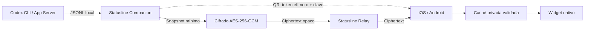

# Statusline

Statusline muestra el estado de la cuota de Codex en Windows, Linux, macOS, iPhone y Android, con widgets nativos y sincronización cifrada de extremo a extremo.

[](https://github.com/arvivares/statusline/actions/workflows/desktop-installers.yml)
[](https://github.com/arvivares/statusline/actions/workflows/android.yml)

El companion consulta la sesión local de Codex; no requiere una API key de OpenAI ni una cuenta compartida entre el ordenador y el teléfono. Cuando el usuario activa la sincronización, publica únicamente un snapshot mínimo cifrado que el relay no puede descifrar.

## Qué incluye

- Estado semanal de Codex, porcentaje restante, fecha de reinicio, ventana corta y plan.
- Companion de bandeja/barra de menú para Windows, Linux y macOS, construido con Tauri, Rust y TypeScript.
- Aplicaciones nativas para iPhone y Android con emparejamiento mediante QR o vínculo privado.
- Widgets Data Plane para iOS y Android alimentados desde caché local.
- Relay universal con credenciales separadas de publicación, emparejamiento y lectura.
- Cifrado AES-256-GCM interoperable entre Rust, Swift y Kotlin.
- Instaladores reproducibles y verificaciones automáticas en GitHub Actions.

## Plataformas

| Plataforma                  | Rol          | Implementación   | Distribución                               |
| --------------------------- | ------------ | ---------------- | ------------------------------------------ |
| Windows x64                 | Publisher    | Tauri + Rust     | NSIS `.exe` y MSI                          |
| Linux x64                   | Publisher    | Tauri + Rust     | DEB, RPM y AppImage                        |
| macOS Apple Silicon + Intel | Publisher    | Tauri + Rust     | DMG y PKG universales                      |
| macOS nativo                | Publisher    | SwiftUI          | Target `StatuslineCompanion` de Xcode      |
| iPhone, iOS 17 o posterior  | Reader       | SwiftUI          | Xcode/TestFlight/App Store, proceso manual |
| Widget de iOS               | Presentación | WidgetKit        | Incluido con la app de iPhone              |
| Android 6.0 o posterior     | Reader       | Kotlin + Compose | APK y AAB firmados                         |
| Widget de Android           | Presentación | App Widget       | Incluido con la app Android                |
| Cloudflare Workers + D1     | Relay        | TypeScript       | Despliegue con Wrangler                    |

`apps/desktop` contiene el companion multiplataforma que genera los instaladores públicos de escritorio. El target SwiftUI `StatuslineCompanion`, dentro de `apps/apple`, se conserva como implementación nativa de macOS; no es necesario para compilar Tauri.

## Cómo funciona



1. El companion inicia `codex app-server` mediante entrada/salida estándar y normaliza sólo los metadatos de cuota.
2. Al crear un canal, el relay entrega credenciales aleatorias de publisher y pairing; el companion genera localmente una clave AES-256.
3. El QR contiene el identificador del canal, un token de un solo uso que vence en diez minutos y la clave. No contiene la credencial publisher ni la URL del relay.
4. La app móvil cambia el token efímero por una credencial reader y conserva reader + clave en el almacén seguro del sistema.
5. El relay almacena hashes de credenciales, timestamps operativos y un solo ciphertext por canal. Nunca recibe la clave de cifrado.
6. La app móvil autentica y descifra el snapshot, lo guarda localmente y actualiza su widget.

El contrato normativo está en [Statusline Relay Protocol v1](protocol/statusline-relay-v1.md), acompañado por un [vector AES-GCM compartido](protocol/fixtures/aes-gcm-v1.json).

## Uso

### 1. Preparar Codex

Instala Codex CLI en el ordenador, ejecútalo y completa **Sign in with ChatGPT**:

```shell
codex --version
codex
```

Statusline detecta instalaciones standalone, npm, Homebrew, Volta, NVM, FNM, asdf, mise y `PATH`. También permite seleccionar manualmente un ejecutable y lo verifica con `codex --version` antes de guardarlo.

### 2. Instalar el companion

Descarga el formato correspondiente desde los artefactos o releases del proyecto:

- Windows: NSIS para instalación normal; MSI para despliegues administrados.
- Linux: DEB, RPM o AppImage.
- macOS: DMG para arrastrar a Aplicaciones; PKG para instalación guiada.

Los instaladores no incluyen Codex ni credenciales de usuario.

### 3. Emparejar el móvil

1. Abre **Connections → Codex Source** y confirma que la CLI esté verificada.
2. En **Universal Relay**, selecciona **Create pairing**.
3. En iOS o Android, abre **Pair device** y escanea el QR o pega el vínculo privado.
4. Actualiza el companion y después la app móvil.
5. Añade el widget desde el selector del sistema.

El QR debe tratarse como una contraseña durante sus diez minutos de vigencia. No lo compartas en logs, capturas o solicitudes de soporte.

## Desarrollo

### Requisitos generales

- Node.js 24 o posterior y npm 11.
- Rust 1.98 mediante rustup para el companion Tauri.
- Codex CLI instalado y autenticado para probar datos reales.
- Requisitos nativos de [Tauri 2](https://v2.tauri.app/start/prerequisites/) para cada escritorio.
- Xcode actual para iOS, WidgetKit y el companion SwiftUI de macOS.
- JDK 17, Android SDK Platform 36 y Build Tools 36.0.0 para Android.
- Una cuenta de Cloudflare sólo si se desplegará una instancia propia del relay.

### Variables de entorno

El repositorio incluye una plantilla sin secretos. Para desarrollo local, cópiala y carga sus valores en la terminal desde la raíz:

```shell
cp .env.example .env
set -a
. ./.env
set +a
```

En PowerShell:

```powershell
Copy-Item .env.example .env
Get-Content .env | Where-Object { $_ -match '^\s*[^#\s][^=]*=' } | ForEach-Object {
  $name, $value = $_ -split '=', 2
  Set-Item -Path "Env:$($name.Trim())" -Value $value.Trim()
}
```

Ninguna herramienta del monorepo carga automáticamente el `.env` de la raíz.

`.env` está excluido de Git. La plantilla cubre el origen del relay, el override opcional de Codex, la firma local de Android y la autenticación no interactiva de Wrangler. El relay también incluye [`services/relay/.dev.vars.example`](services/relay/.dev.vars.example); actualmente no necesita secretos de runtime. Nunca copies API keys de OpenAI, tokens de pairing, certificados ni credenciales reales a un archivo versionado.

### Companion desktop

```shell
cd apps/desktop
npm ci
npm test
npm run check
npm run release:check
```

Para desarrollo visual sin iniciar Rust:

```shell
npm run dev
```

Vite expone previews con `?preview=ready`, `loading`, `empty` o `error`; `&panel=source` y `&panel=relay` abren las superficies de configuración.

Para ejecutar Tauri contra un relay local:

```shell
export STATUSLINE_RELAY_BASE_URL="http://127.0.0.1:8787"
npm run tauri dev
```

HTTP sólo se acepta para loopback en Debug. Los builds de producción requieren un origen HTTPS.

### Relay

```shell
cd services/relay
npm ci
npm run db:migrate:local
npm test
npm run check
npm run dev
```

El adaptador operativo usa Cloudflare Workers + D1. Para desplegar una instancia:

```shell
npx wrangler d1 create statusline-relay
# Copiar database_id a wrangler.jsonc
npm run db:migrate:remote
npm run deploy
```

La guía [Opciones de despliegue y capacidad](docs/relay/deployment-options.md) documenta límites, consumo observado y la futura alternativa autohospedada en Linux. Esa alternativa todavía no se distribuye como contenedor listo para producción.

### Android

```shell
cd apps/android
./gradlew testDebugUnitTest lintDebug assembleDebug
```

Para usar otro relay compatible:

```shell
./gradlew assembleDebug \
  -PSTATUSLINE_RELAY_BASE_URL=https://relay.example.com
```

`VIEW DEMO` crea una muestra local claramente identificada y actualiza app + widget sin red, cuenta de Codex ni desktop.

### iOS y macOS SwiftUI

Abre [apps/apple/statusline.xcodeproj](apps/apple/statusline.xcodeproj) en Xcode. Configura `STATUSLINE_RELAY_BASE_URL` en Build Settings con el mismo origen usado por desktop y Android. La primera distribución de iOS está limitada a iPhone y requiere archive, firma y subida manual a TestFlight/App Store.

## Configuración del relay

Todos los clientes de una instalación deben confiar en el mismo origen:

```text
STATUSLINE_RELAY_BASE_URL=https://statusline-relay.inmerzion.workers.dev
```

La URL es pública y no concede acceso a ningún canal. Los secretos se generan después de la instalación y permanecen en Keychain, Windows Credential Manager, Secret Service o Android Keystore.

El despliegue de referencia aplica:

- 60 solicitudes por minuto y origen antes de consultar D1;
- 10 canales nuevos por minuto y origen;
- 120 operaciones por minuto y credencial;
- 10 minutos de vigencia para pairing;
- 30 días de vigencia del canal desde la creación o última publicación;
- purga diaria de canales vencidos.

## Seguridad y privacidad

Statusline no lee ni transmite API keys, access tokens de Codex, correo, prompts, conversaciones o código fuente. El snapshot cifrado contiene únicamente:

- versión del esquema;
- porcentaje semanal restante;
- fecha de reinicio;
- fecha de actualización.

El relay no puede descifrarlo. La secuencia monotónica impide reproducir snapshots anteriores y las credenciales de publisher, pairing y reader tienen capacidades separadas.

Consulta la [política de privacidad](PRIVACY.md), la [revisión de seguridad](docs/security/security-review.md) y el [modelo de arquitectura](docs/architecture/cross-platform-companion.md). Nunca añadas una API key de OpenAI, certificados, keystores o vínculos de pairing al repositorio.

## Builds y distribución

### Escritorio

[Desktop installers](.github/workflows/desktop-installers.yml) genera de forma nativa:

1. Windows NSIS `.exe`.
2. Windows MSI.
3. Linux DEB.
4. Linux RPM.
5. Linux AppImage.
6. macOS DMG universal.
7. macOS PKG universal.
8. `SHA256SUMS.txt` para verificar el conjunto.

El pipeline instala, abre y desinstala ambos formatos de Windows; valida paquetes Linux; inspecciona arquitecturas, firma, notarización, tickets grapados y Gatekeeper en macOS. Las releases públicas por tag requieren Authenticode para Windows y Developer ID + notarización para macOS. Los runs manuales pueden producir Windows sin firma para QA privado.

Consulta [Instaladores de Statusline Companion](docs/release/desktop-installers.md) para variables, secretos y smoke tests.

### Android

[Android artifacts](.github/workflows/android.yml) ejecuta unit tests, Lint y genera un APK Debug. Un tag `android-v*` o un dispatch explícito de release añade APK y AAB firmados, mapping de R8 y checksums. El material de firma vive únicamente en GitHub Actions secrets.

### iOS

iOS no se compila desde el pipeline actual. Archive, firma, TestFlight y App Store se realizan desde Xcode hasta incorporar una estrategia segura de firma en CI.

La [checklist de beta pública](docs/release/public-beta-checklist.md) concentra los gates de producto, tiendas, firma, integridad y soporte.

## Estructura del repositorio

| Ruta                                  | Contenido                                                                                   |
| ------------------------------------- | ------------------------------------------------------------------------------------------- |
| `apps/desktop/`                       | Companion Tauri para Windows, Linux y macOS                                                 |
| `apps/android/`                       | App, QR scanner y widget nativos de Android                                                 |
| [`apps/apple/`](apps/apple/README.md) | Proyecto Xcode y targets de iPhone, WidgetKit y macOS                                       |
| `services/relay/`                     | Worker, D1, rate limits y páginas públicas                                                  |
| `protocol/`                           | Especificación v1, fixtures y ejemplos interoperables                                       |
| `docs/`                               | Arquitectura, despliegue, releases, seguridad y [archivo de diseño](docs/archive/README.md) |
| `.github/workflows/`                  | Pipelines desktop y Android                                                                 |

Las dependencias y salidas de build (`node_modules`, `target`, `dist`, `.gradle`, `build`, `.wrangler`) no forman parte del repositorio y pueden regenerarse desde sus manifests y lockfiles.

## Estado y limitaciones conocidas

- Codex App Server sigue siendo experimental; un cambio incompatible puede requerir actualizar el companion.
- Las apps móviles refrescan al abrirse o por acción del usuario. APNs/FCM todavía no señalizan snapshots en segundo plano.
- El relay autohospedado para Linux está diseñado, pero su imagen y adaptador persistente aún no están publicados.
- El updater integrado de Tauri todavía no está habilitado.
- Los binarios Windows públicos necesitan un certificado Authenticode; los builds manuales sin firma son sólo para pruebas.
- iOS requiere un proceso de distribución manual desde Xcode.

## Soporte

Consulta [SUPPORT.md](SUPPORT.md), visita la [página pública de soporte](https://statusline-relay.inmerzion.workers.dev/support) o escribe a [founder@inmerzion.io](mailto:founder@inmerzion.io). Elimina identificadores, rutas privadas, QR, pairing links y credenciales antes de enviar un diagnóstico.

## Licencia

Statusline es software open source distribuido bajo la [licencia MIT](LICENSE).
