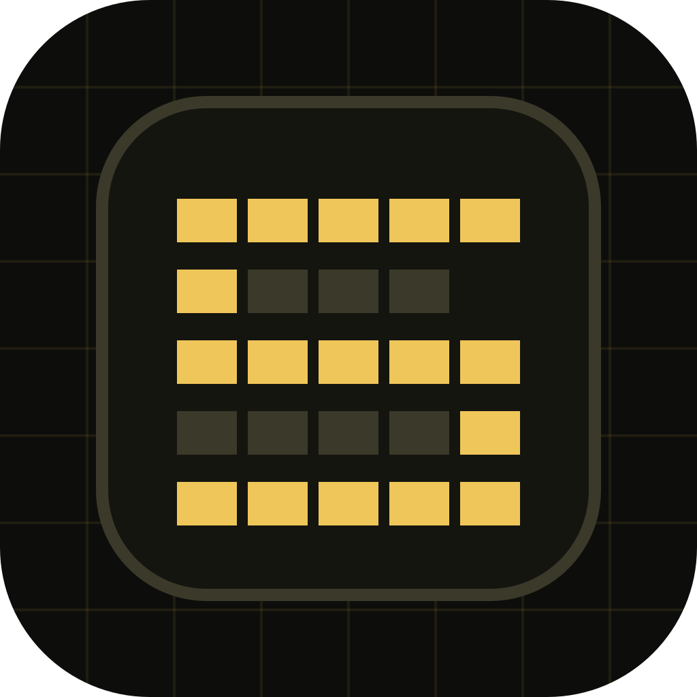
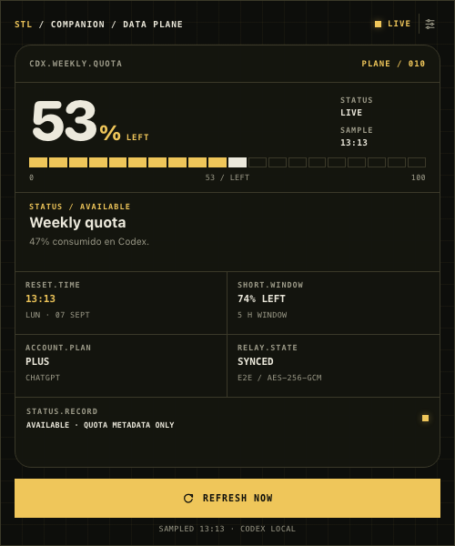
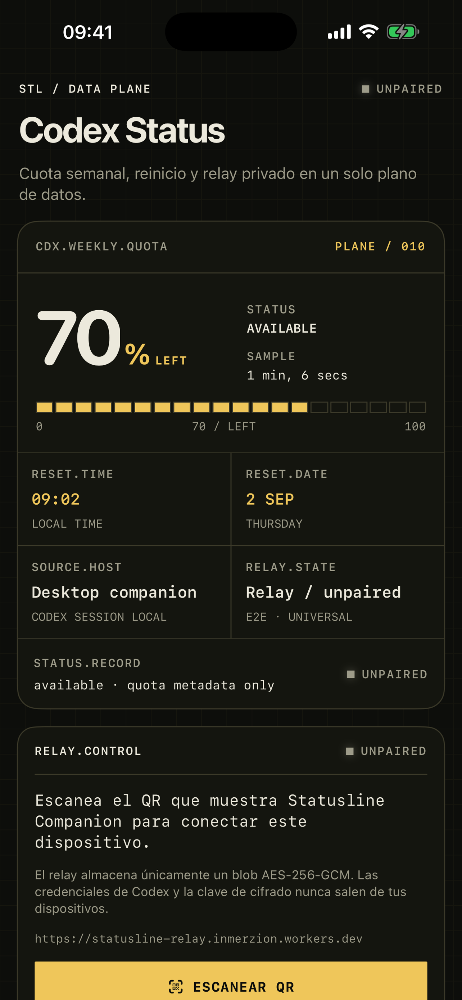
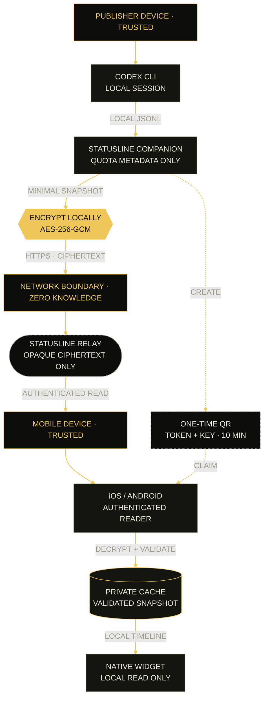

<div align="center">
  
  <h1>Statusline</h1>
  <p><strong>Your Codex usage, visible everywhere.</strong></p>
  <p>Cross-platform desktop companion, encrypted mobile sync and native widgets for iPhone and Android.</p>
  <p><strong>English</strong> · <a href="README.es.md">Español</a></p>
</div>

<div align="center">
  <a href="https://github.com/arvivares/statusline/actions/workflows/repository-quality.yml"></a>
  <a href="https://github.com/arvivares/statusline/actions/workflows/release.yml"></a>
  <a href="https://github.com/arvivares/statusline/actions/workflows/desktop-installers.yml"></a>
  <a href="https://github.com/arvivares/statusline/actions/workflows/android.yml"></a>
  <a href="LICENSE"></a>
</div>

Statusline shows the remaining Codex quota and reset time on Windows, Linux, macOS,
iPhone and Android. The desktop companion reads usage metadata from the user's local
Codex session, then optionally sends an end-to-end encrypted snapshot to the mobile
apps and widgets.

No OpenAI API key is required. Statusline never asks for or transports Codex account
credentials, prompts, conversations or source code.

> [!NOTE]
> Statusline is an independent open-source project. It is not affiliated with,
> sponsored by or endorsed by OpenAI.

## Product

<table>
  <tr>
    <td align="center" width="64%">
      
    </td>
    <td align="center" width="36%">
      
    </td>
  </tr>
  <tr>
    <td align="center"><strong>Companion</strong><br><sub>Windows · Linux · macOS</sub></td>
    <td align="center"><strong>Mobile</strong><br><sub>iPhone · Android</sub></td>
  </tr>
</table>

The Data Plane interface keeps quota, reset and sync state consistent across desktop,
mobile and native widgets.

### Highlights

- Weekly and short-window usage, percentage remaining, reset time and account plan.
- Menu-bar and system-tray companion built with Tauri, Rust and TypeScript.
- Native SwiftUI and Kotlin applications with QR or private-link pairing.
- Native WidgetKit and Android App Widget extensions backed by a private local cache.
- System-language UI in English or Spanish, with English fallback for other languages.
- Provider-neutral relay protocol with separate publisher, pairing and reader credentials.
- AES-256-GCM encryption interoperable across Rust, Swift and Kotlin.
- Reproducible installers, checksums, signing gates and automated validation.

### Project status

Statusline is in beta. The product flow has been tested on physical mobile devices and
desktop installers are generated for all supported operating systems. Store review and
public code-signing onboarding are tracked in the
[public beta checklist](docs/release/public-beta-checklist.md).

| Surface                     | Status                | Distribution                                             |
| --------------------------- | --------------------- | -------------------------------------------------------- |
| Windows x64                 | Beta                  | NSIS and MSI; public Authenticode onboarding in progress |
| Linux x64                   | Beta                  | DEB, RPM and AppImage with OpenPGP signatures            |
| macOS Apple Silicon + Intel | Beta                  | Universal DMG and PKG, Developer ID and notarization     |
| iPhone, iOS 17+             | Beta                  | TestFlight and App Store process                         |
| Android 6.0+                | Beta                  | Signed APK/AAB and Google Play closed testing            |
| Cloudflare Workers + D1     | Operational reference | Public encrypted relay                                   |

## Releases

Permanent downloads are published on [GitHub Releases](https://github.com/arvivares/statusline/releases).
The current `windows-bootstrap-v0.1.6` entry is an explicitly unsigned Windows onboarding
preview for SignPath Foundation, not the public beta intended for end users.

The signed `v0.1.11` tag publishes the English/Spanish tester prerelease with Linux
DEB/RPM/AppImage, universal macOS DMG/PKG and signed Android APK/AAB. Automated inventory,
checksums, platform trust checks and GitHub build provenance must all pass before it
becomes public. Windows remains in its separate unsigned onboarding preview until
SignPath Foundation approval; it will join the unified release only after Authenticode
signing is operational. Action artifacts are temporary QA outputs and are never presented
as releases.

See the [public release runbook](docs/release/release-runbook.md) for the exact asset list,
SignPath configuration and verification commands.

## Roadmap

Codex is the complete v1 experience. The next product stage is a capability-based
adapter architecture that can show Codex, AGY, Claude Code, GitHub Copilot and future
coding agents in one honest capacity view—even when providers expose different units.

The current order is: ship the Codex foundation, extract the shared provider contract,
validate AGY as the first additional adapter, then research supported Claude Code and
GitHub Copilot integrations. Planned product work includes multi-provider widgets, a
cross-provider reset timeline, local history, low-capacity alerts, forecasts with clear
confidence and an independently hosted relay.

See the [full product and engineering roadmap](ROADMAP.md) for feasibility findings,
privacy constraints, architecture milestones and the feature backlog.

## How it works



Solid lines are the recurring refresh path. The dashed path is the single-use pairing
handoff; the relay never receives the encryption key.

1. The companion starts the locally installed `codex app-server` process and normalizes
   only quota metadata.
2. When a channel is created, the relay returns independent publisher and pairing
   credentials. The companion generates a 256-bit encryption key locally.
3. The QR contains the channel ID, a single-use pairing token that expires after ten
   minutes and the encryption key. It never contains the publisher credential.
4. The mobile app exchanges the ephemeral token for a reader credential and stores the
   reader plus encryption key in the operating system's secure store.
5. The relay stores credential hashes, operational timestamps and one ciphertext per
   channel. It never receives the encryption key.
6. Mobile validates and decrypts the snapshot locally, updates its private cache and
   refreshes the widget.

The normative contract is [Statusline Relay Protocol v1](protocol/statusline-relay-v1.md),
with a shared [AES-GCM interoperability vector](protocol/fixtures/aes-gcm-v1.json).

## Use Statusline

### 1. Prepare Codex

Install Codex CLI on the desktop, launch it and complete **Sign in with ChatGPT**:

```shell
codex --version
codex
```

Statusline discovers standalone, npm, Homebrew, Volta, NVM, FNM, asdf, mise and `PATH`
installations. A manually selected executable is validated with `codex --version` before
it is stored.

### 2. Install the companion

Download the appropriate package from
[GitHub Releases](https://github.com/arvivares/statusline/releases) when a public beta is
available, or build it from source:

- Windows: NSIS for normal installation, MSI for managed deployment.
- Linux: DEB, RPM or AppImage.
- macOS: DMG for drag-and-drop installation, PKG for guided installation.

The installers do not bundle Codex or user credentials.

### 3. Pair a mobile device

1. Open **Connections → Codex Source** and verify the detected CLI.
2. Under **Universal Relay**, select **Create pairing**.
3. On iPhone or Android, open **Pair device** and scan the QR or paste its private link.
4. Refresh the companion and then the mobile app.
5. Add Statusline from the operating system's widget gallery.

Treat the QR as a password during its ten-minute lifetime. Never share it in logs,
screenshots or support requests.

## Development

### Requirements

- Node.js 24 and npm 11.
- Rust 1.98 through rustup.
- Codex CLI installed and authenticated for real-data testing.
- Native [Tauri 2 prerequisites](https://v2.tauri.app/start/prerequisites/) for the host OS.
- Xcode for the iPhone, WidgetKit and native macOS targets.
- JDK 17, Android SDK Platform 37.0 and Build Tools 36.0.0 for Android.
- A Cloudflare account only when deploying a separate relay instance.

The repository pins its primary development versions in `.node-version`,
`.java-version` and `rust-toolchain.toml`.

### Environment

Copy the documented, secret-free template when local overrides are needed:

```shell
cp .env.example .env
```

No project automatically loads the root `.env`. Never add OpenAI keys, pairing links,
certificates, keystores or real credentials to a tracked file. The complete deployment
flow is documented in the [universal setup guide](SETUP.md), currently maintained in
Spanish.

### Desktop companion

```shell
cd apps/desktop
npm ci
npm test
npm run check
npm run release:check
```

Run `npm run dev` for browser-based interface previews, or `npm run tauri dev` for the
native companion.

### Relay

```shell
cd services/relay
npm ci
npm run db:migrate:local
npm test
npm run check
```

The production adapter uses Cloudflare Workers + D1. Its provider-neutral HTTP core and
`RelayStore` boundary are designed to support an independently hosted Linux adapter.

### Android

```shell
cd apps/android
./gradlew testDebugUnitTest lintDebug assembleDebug
```

`VIEW DEMO` creates a clearly marked local sample for app and widget review without a
network connection, Codex account or desktop companion.

### Apple platforms

Open [apps/apple/statusline.xcodeproj](apps/apple/statusline.xcodeproj) in Xcode. Set
`STATUSLINE_RELAY_BASE_URL` for both the iPhone and native companion Release
configurations. App Store archives are currently signed and uploaded manually.

## Security and privacy

Statusline does not read or transmit API keys, Codex access tokens, account email,
prompts, conversations or source code. An encrypted snapshot contains only:

- schema version;
- weekly percentage remaining;
- reset timestamp;
- sample timestamp.

Publisher, pairing and reader credentials have separate capabilities. Pairing is
single-use, channels expire after inactivity and monotonically increasing sequence
numbers prevent replaying an older snapshot.

Read the [privacy policy](PRIVACY.md), [security policy](SECURITY.md),
[security review](docs/security/security-review.md) and
[architecture](docs/architecture/cross-platform-companion.md). Please report suspected
vulnerabilities privately rather than opening a public issue.

## Code signing policy

Free code signing provided by [SignPath.io](https://signpath.io/), certificate by [SignPath Foundation](https://signpath.org/).

Statusline has selected SignPath Foundation for public Windows releases. Onboarding is
still in progress. The repository-side two-stage workflow is ready and waits for the real
SignPath project identifiers and token. Until the integration and independent verification
are complete, Windows artifacts are unsigned QA builds and are not represented as official
signed releases.

- Committer and reviewer: [Alan Rodrigo Vivares (`@arvivares`)](https://github.com/arvivares)
- Release and signing approver: [Alan Rodrigo Vivares (`@arvivares`)](https://github.com/arvivares)
- Privacy: [Statusline Privacy Policy](PRIVACY.md)
- Full process: [Statusline Code Signing Policy](docs/security/code-signing-policy.md)

The unified `v<version>` release tag fails closed unless every platform enabled in
`release.json` satisfies its signing, trust, inventory, checksum and provenance gates.
Windows cannot enter that profile until Authenticode is operational. Manual component
workflows may generate explicitly unsigned artifacts for private QA only.

## Repository map

| Path                                  | Purpose                                                    |
| ------------------------------------- | ---------------------------------------------------------- |
| `apps/desktop/`                       | Tauri companion for Windows, Linux and macOS               |
| `apps/android/`                       | Android app, QR scanner, widget and Play Store kit         |
| [`apps/apple/`](apps/apple/README.md) | Xcode project for iPhone, WidgetKit and native macOS       |
| `services/relay/`                     | Worker, D1 adapter, rate limiting and public pages         |
| `protocol/`                           | Versioned protocol, fixtures and interoperability examples |
| `localization/`                       | Shared English/Spanish messages and locale test cases      |
| `packaging/`                          | Public verification material for distributed packages      |
| [`docs/`](docs/README.md)             | Architecture, operations, release and security records     |
| [`release.json`](release.json)        | Canonical product and component release versions           |
| `.github/workflows/`                  | Validation and distribution pipelines                      |

Dependencies and build outputs such as `node_modules`, `target`, `dist`, `.gradle`,
`build` and `.wrangler` are reproducible and intentionally excluded from Git.

## Documentation

- [Documentation index](docs/README.md)
- [Product and engineering roadmap](ROADMAP.md)
- [Universal setup (Spanish)](SETUP.md)
- [Architecture](docs/architecture/cross-platform-companion.md)
- [Relay deployment and capacity](docs/relay/deployment-options.md)
- [Desktop installers](docs/release/desktop-installers.md)
- [Public release runbook](docs/release/release-runbook.md)
- [Public repository launch checklist](docs/release/public-repository-checklist.md)
- [Support and troubleshooting](SUPPORT.md)
- [Contributing](CONTRIBUTING.md)

## Contributing

Issues and pull requests are welcome. Please read [CONTRIBUTING.md](CONTRIBUTING.md) and
the [Code of Conduct](CODE_OF_CONDUCT.md) first. Security reports must follow
[SECURITY.md](SECURITY.md).

## Trademark notice

OpenAI, ChatGPT and Codex are trademarks or registered trademarks of their respective
owners. Their use here identifies interoperability with the locally installed Codex
software and does not imply affiliation or endorsement.

## License

Copyright © 2026 Inmerzion. Released under the [MIT License](LICENSE).
