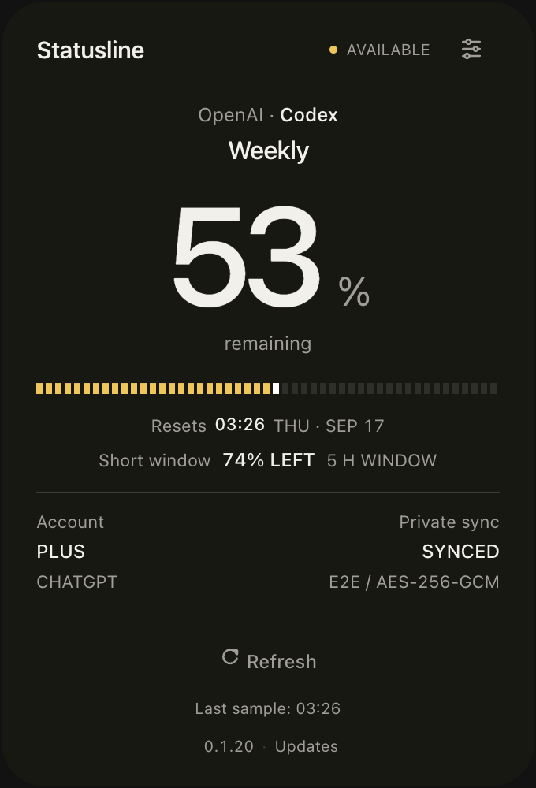
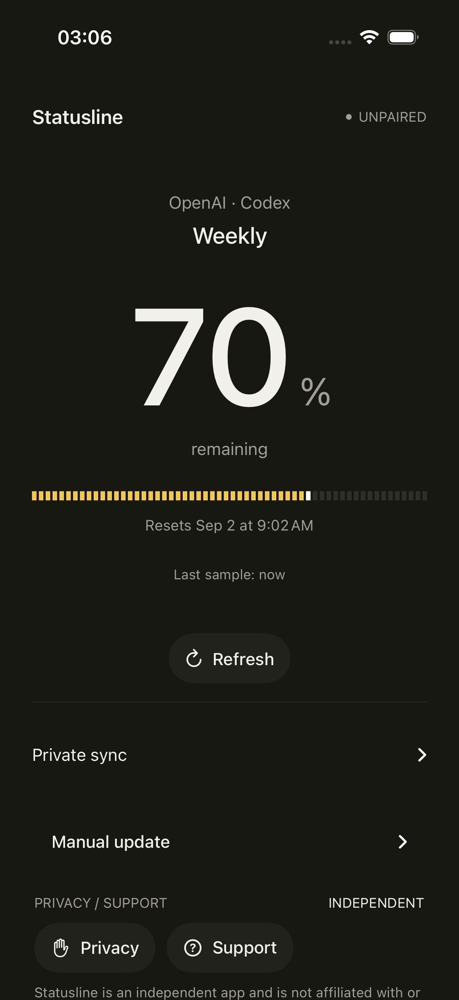
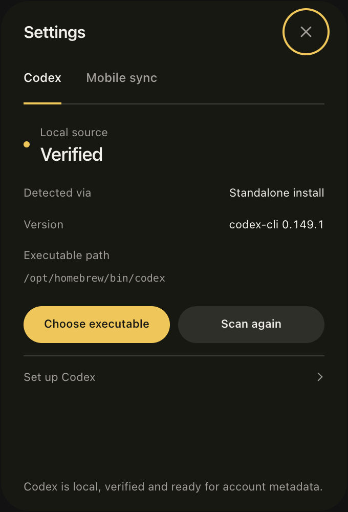
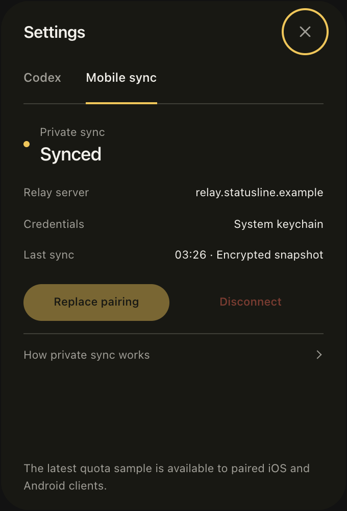
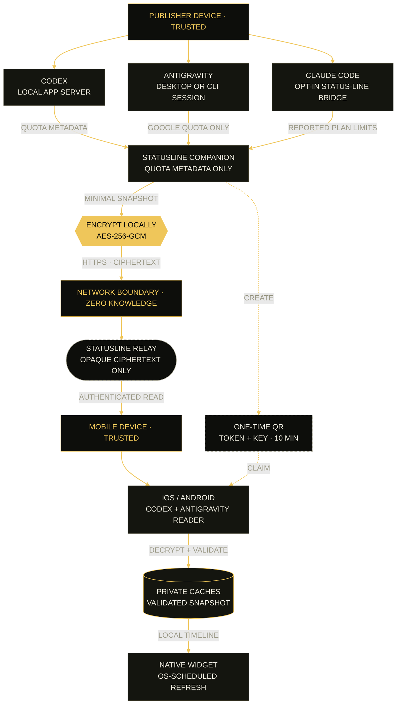

<div align="center">
  
  <h1>Statusline</h1>
  <p><strong>Codex, Antigravity and Claude Code quotas at a glance.</strong></p>
  <p>One desktop companion. Separate limits, clear resets and private mobile sync.</p>
  <p><strong>English</strong> · <a href="README.es.md">Español</a></p>
  <p><a href="https://statusline.inmerzion.io/"><strong>Official website</strong></a> · <a href="https://apps.apple.com/app/statusline/id6807851320">App Store</a> · <a href="https://github.com/arvivares/statusline/releases">Downloads</a></p>
</div>

<div align="center">
  <a href="https://github.com/arvivares/statusline/actions/workflows/repository-quality.yml"></a>
  <a href="https://github.com/arvivares/statusline/actions/workflows/release.yml"></a>
  <a href="https://github.com/arvivares/statusline/actions/workflows/desktop-installers.yml"></a>
  <a href="https://github.com/arvivares/statusline/actions/workflows/android.yml"></a>
  <a href="LICENSE"></a>
</div>

Statusline shows the remaining quota and reset times for **OpenAI Codex, Google
Antigravity and Anthropic Claude Code** in a compact desktop companion for Windows,
Linux and macOS. Switch between your detected services without opening each tool.
Each provider keeps its own limits and sample time; an unavailable quota is never
shown as full or empty.

Optional end-to-end encrypted sync brings **Codex and Antigravity** to compatible
iPhone and Android apps and widgets. Claude Code quota is currently desktop-only.
You do not need all three providers or an OpenAI API key to use Statusline.

> [!NOTE]
> Statusline is an independent open-source project. It is not affiliated with,
> sponsored by or endorsed by OpenAI, Google or Anthropic.

## Supported providers

| Provider                    | What the companion shows                                                          | Local requirement                                                         | Mobile apps and widgets                                     |
| --------------------------- | --------------------------------------------------------------------------------- | ------------------------------------------------------------------------- | ----------------------------------------------------------- |
| **OpenAI · Codex**          | General Codex quota: weekly and short windows, reset times and plan when reported | A supported Codex desktop runtime or CLI, signed in with ChatGPT          | Codex; older clients retain the weekly view                 |
| **Google · Antigravity**    | Google Gemini weekly and five-hour quota groups, when reported                    | Official Antigravity Desktop or a supported AGY CLI, already signed in    | Codex/Antigravity-capable clients and a `services-v1` relay |
| **Anthropic · Claude Code** | Five-hour and seven-day plan limits, only when Claude Code reports them           | Claude Code CLI, explicit **Enable quota** consent and a session response | Not yet supported                                           |

These are separate provider readings, not a combined percentage or interchangeable
credits. Antigravity's third-party model buckets are excluded. Claude accounts may
report only one window; API-key/cloud sessions do not provide plan quota, and a
gateway spend cap is not treated as remaining quota.

Use only the services installed on your computer. Collection is independent, so an
unavailable service does not replace another provider's reading. See the
[Codex](docs/architecture/codex-sources.md),
[Antigravity](docs/architecture/antigravity-companion.md) and
[Claude Code](docs/architecture/claude-sources.md) source guides for supported
installations and validation limits.

## Product

<table>
  <tr>
    <td align="center" width="64%">
      
    </td>
    <td align="center" width="36%">
      
    </td>
  </tr>
  <tr>
    <td align="center"><strong>Companion</strong><br><sub>Codex demo · 0.1.20 capture</sub></td>
    <td align="center"><strong>iPhone</strong><br><sub>Native app · local Codex demo</sub></td>
  </tr>
</table>

**Still Signature** puts the remaining quota first: one warm dark surface,
restrained typography and a gold segmented meter with a white terminal stripe.
The companion is compact at 340 × 500 logical pixels. iPhone, Android and native
widgets share the same visual language.

These existing Codex captures use demo data, not a personal account. They were
prepared for 0.1.20 and do not show the newer multi-provider interface. The iPhone
image comes from an iOS simulator; source changes and App Store rollout are separate.
See [capture provenance and reproduction](docs/assets/readme/README.md#still-signature-product-captures).

<details>
  <summary>Companion settings · Codex and mobile sync · 0.1.20 examples</summary>
  <br>
  <table>
    <tr>
      <td align="center"></td>
      <td align="center"></td>
    </tr>
    <tr>
      <td align="center"><strong>Codex</strong></td>
      <td align="center"><strong>Mobile sync</strong></td>
    </tr>
  </table>
</details>

The segmented gold **S** is Statusline's official logo. Its shared source and
platform exports are maintained in the [brand kit](branding/README.md).

### Download for iPhone

<div align="center">
  <a href="https://apps.apple.com/app/statusline/id6807851320">
    
  </a>
  <p><a href="https://apps.apple.com/app/statusline/id6807851320"><strong>Download on the App Store</strong></a><br><sub>Free · iPhone · iOS 17 or later</sub></p>
</div>

Scan with your iPhone camera, or tap the link from your phone. This is a public
download QR, not a private device-pairing code.

### Android · Coming soon

**Coming soon on Google Play.** The store download link and QR will be added here
once the app is approved. Android beta APKs are already available on
[GitHub Releases](https://github.com/arvivares/statusline/releases).

### Highlights

- Codex, Antigravity and opt-in Claude Code quota in one desktop focus/watchlist.
- Provider-specific windows, percentage remaining, reset times and sample freshness.
- Menu-bar and system-tray companion built with Tauri, Rust and TypeScript.
- Native SwiftUI and Kotlin applications with QR or private-link pairing.
- Codex and Antigravity in compatible mobile apps, WidgetKit and Android widgets,
  backed by private local caches; older clients remain Codex-only.
- System-language UI in English or Spanish, with English fallback for other languages.
- Companion update notices from GitHub Releases, with verified downloads and
  installation on confirmation; see [update support](docs/architecture/companion-updates.md).
- Provider-neutral relay protocol with separate publisher, pairing and reader credentials.
- AES-256-GCM encryption interoperable across Rust, Swift and Kotlin.
- Reproducible installers, checksums, signing gates and automated validation.

### Project status

Statusline for iPhone is available on the App Store; desktop and Android remain in
beta. The product flow has been tested on physical mobile devices and desktop
installers are generated for all supported operating systems. Store review and
public code-signing onboarding are tracked in the
[public beta checklist](docs/release/public-beta-checklist.md).

| Surface                     | Status                | Distribution                                                    |
| --------------------------- | --------------------- | --------------------------------------------------------------- |
| Windows x64                 | Beta                  | NSIS and MSI; public Authenticode onboarding in progress        |
| Linux x64                   | Beta                  | DEB, RPM and AppImage with OpenPGP signatures                   |
| macOS Apple Silicon + Intel | Beta                  | Universal DMG and PKG, Developer ID and notarization            |
| iPhone, iOS 17+             | Available             | [App Store](https://apps.apple.com/app/statusline/id6807851320) |
| Android 6.0+                | Beta                  | Signed APK/AAB and Google Play closed testing                   |
| Cloudflare Workers + D1     | Operational reference | Public encrypted relay                                          |

## Releases

Permanent downloads are published on [GitHub Releases](https://github.com/arvivares/statusline/releases).
The current `windows-bootstrap-v0.1.6` entry is an explicitly unsigned Windows onboarding
preview for SignPath Foundation, not the public beta intended for end users.

The repository version is **0.1.30 Beta**; see its
[release notes](docs/release/notes/v0.1.30.md). The release configuration publishes a
normal GitHub release, not a Pre-release, but the product remains beta. It includes
Windows NSIS/MSI previews, Linux DEB/RPM/AppImage, universal macOS DMG/PKG and signed
Android APK/AAB. Preparing source metadata does not publish the installers. Automated inventory,
checksums, platform trust checks and GitHub build provenance must all pass before it
becomes public. **Windows installers are unsigned previews without Authenticode** while
SignPath Foundation onboarding is pending; their filenames contain `.unsigned` and
SmartScreen may warn or block installation. Signed checksums and GitHub provenance
verify their integrity, not Windows publisher trust. Do not disable Windows security
protections. Action artifacts are temporary QA outputs, not releases.

See the [public release runbook](docs/release/release-runbook.md) for the exact asset list,
SignPath configuration and verification commands.

## Roadmap

The desktop companion already supports Codex, Antigravity and opt-in Claude Code.
Codex/Antigravity mobile apps and widgets use the additive encrypted services
inventory without replacing existing pairings.

Next steps include Claude support on mobile, real-session Claude validation on
Windows and Linux, and broader installed-package QA. Further product work includes
a cross-provider reset timeline, local history, low-capacity alerts, forecasts with
clear confidence and an independently hosted relay. GitHub Copilot and other future
adapters remain research, not current features.

See the [full product and engineering roadmap](ROADMAP.md) for feasibility findings,
privacy constraints, architecture milestones and the feature backlog.

## How it works



Solid lines are the recurring refresh path. The dashed path is the single-use pairing
handoff; the relay never receives the encryption key.

1. Independent collectors read supported local sources: Codex App Server, the selected
   Antigravity Desktop/CLI session and Claude Code's explicitly enabled status-line
   bridge. They retain quota metadata, not conversations or source code.
2. When a channel is created, the relay returns independent publisher and pairing
   credentials. The companion generates a 256-bit encryption key locally.
3. The QR contains the channel ID, a single-use pairing token that expires after ten
   minutes and the encryption key. It never contains the publisher credential.
4. The mobile app exchanges the ephemeral token for a reader credential and stores the
   reader plus encryption key in the operating system's secure store.
5. The relay stores credential hashes, operational timestamps and opaque encrypted
   snapshots. It never receives the encryption key. A compatible relay accepts the
   services inventory alongside the legacy Codex snapshot.
6. Mobile validates and decrypts the snapshot locally and updates its private cache.
   Current apps and widgets render Codex and Antigravity; they ignore Claude entries.
   Older readers continue using the Codex weekly snapshot.

The normative contract is [Statusline Relay Protocol v1](protocol/statusline-relay-v1.md)
with its additive [services-v1 extension](protocol/statusline-services-v1.md) and
shared [AES-GCM interoperability vector](protocol/fixtures/aes-gcm-v1.json).

## Use Statusline

### 1. Prepare the providers you use

#### Codex

On macOS, you can use **Codex inside ChatGPT or Codex.app** without installing a
separate CLI. Install the desktop app in Applications, open Codex and sign in with
ChatGPT. Statusline detects its bundled runtime automatically.

Windows desktop-app detection supports registered OpenAI MSIX packages and
conventional installations. **Desktop-only Windows validation remains pending**;
see the [source guide](docs/architecture/codex-sources.md#windows-desktop-discovery).

Alternatively, on macOS, Windows or Linux, install Codex CLI and complete
**Sign in with ChatGPT**:

```shell
codex --version
codex
```

Statusline discovers standalone, npm, Homebrew, Volta, NVM, FNM, asdf, mise and `PATH`
installations. A manually selected executable is validated with `codex --version` before
it is stored.

Desktop-session reuse depends on OpenAI's local authentication mode. See
[Codex sources](docs/architecture/codex-sources.md) for supported macOS locations,
source precedence and what to do if the bundled runtime still asks for sign-in.

#### Antigravity

Install and sign in to official **Antigravity Desktop** or **AGY CLI**. Companion
automatically discovers supported installations, preferring Desktop on first setup.
The selected source is remembered: a sign-out or failed read does not silently switch
to another account. Advanced source selection and disabling collection are available
in **Settings → Services**.

The CLI adapter requires the supported read-only `/usage` command family (major 1,
version 1.1.11 or later). Only Google's Gemini weekly/five-hour groups are included;
see [Antigravity setup and boundaries](docs/architecture/antigravity-companion.md).

#### Claude Code

Install **Claude Code CLI**, open a signed-in session, then choose **Enable quota**
in Companion or **Connect Claude Code** in **Settings → Services**. This is an
explicit opt-in: Statusline adds its bridge to Claude Code's `statusLine` setting,
preserves an existing custom status line and restores it when disconnected.

Quota appears after Claude Code reports plan limits in a session response. Installing
the Claude chat desktop app alone is insufficient. Missing windows remain unknown;
the last sample is not a promise of live usage from other devices or claude.ai.
Real-session validation covers macOS; Windows/Linux have tests and fixtures, with
real-session QA still pending. See [Claude source details](docs/architecture/claude-sources.md).

### 2. Install the companion

Download the appropriate package from
[GitHub Releases](https://github.com/arvivares/statusline/releases), or build it from source:

- Windows: NSIS for normal installation, MSI for managed deployment.
- Linux: DEB, RPM or AppImage.
- macOS: DMG for drag-and-drop installation, PKG for guided installation.

The installers do not bundle provider applications or user credentials.

### 3. Pair a mobile device

1. Confirm that the companion shows a Codex or Antigravity reading. Claude mobile display is not yet supported.
2. Open mobile sync settings and select **Create pairing**.
3. On iPhone or Android, open **Pair device** and scan the QR or paste its private link.
4. Refresh the companion and then the mobile app.
5. Add Statusline from the operating system's widget gallery.

Antigravity sync requires a relay with `services-v1` and compatible readers (implemented
from iOS 1.1.0 / Android 0.1.25). Source versions do not guarantee a store rollout.
Existing pairings remain valid; a Codex-only client does not become multi-provider
until its app is updated.

Treat the companion's pairing QR as a password during its ten-minute lifetime. Never share it in logs,
screenshots or support requests.

## Development

### Requirements

- Node.js 26.9.0 and npm 11.19.1 (build tooling; see the [Node policy](docs/architecture/node-toolchain.md)).
- Rust 1.98 through rustup.
- At least one supported, authenticated provider installation for real-data testing;
  Claude Code also requires explicit bridge activation. Synthetic tests need no account.
- Native [Tauri 2 prerequisites](https://v2.tauri.app/start/prerequisites/) for the host OS.
- Xcode for the iPhone, WidgetKit and native macOS targets.
- JDK 17, Android SDK Platform 37.0 and Build Tools 36.0.0 for Android.
- A Cloudflare account only when deploying a separate relay instance.

The repository pins its primary development versions in `.node-version`,
`.java-version` and `rust-toolchain.toml`.

### Environment

Copy the documented, secret-free template when local overrides are needed:

```shell
cp .env.example .env
```

No project automatically loads the root `.env`. Never add OpenAI keys, pairing links,
certificates, keystores or real credentials to a tracked file. The complete deployment
flow is documented in the [universal setup guide](SETUP.md), currently maintained in
Spanish.

### Desktop companion

```shell
cd apps/desktop
npm ci
npm test
npm run check
npm run release:check
```

Run `npm run dev` for browser-based interface previews, or `npm run tauri dev` for the
native companion.

`apps/desktop` is the multi-provider companion shipped in desktop installers.
The retained SwiftUI macOS target in `apps/apple` is Codex-focused, not the
multi-provider desktop implementation.

### Presentation website

The standalone [website](apps/web/README.md) targets
[statusline.inmerzion.io](https://statusline.inmerzion.io). It uses local assets and
explicit sample data, without a relay backend.

```shell
cd apps/web
npm ci
npm run dev -- --port 4173
```

Run `npm run check`, `npm run format:check` and `npm run build` before publishing.

### Relay

```shell
cd services/relay
npm ci
npm run db:migrate:local
npm test
npm run check
```

The production adapter uses Cloudflare Workers + D1. Its provider-neutral HTTP core and
`RelayStore` boundary are designed to support an independently hosted Linux adapter.

### Android

```shell
cd apps/android
./gradlew testDebugUnitTest lintDebug assembleDebug
```

`VIEW DEMO` creates a clearly marked local sample for app and widget review without a
network connection, Codex account or desktop companion.

### Apple platforms

Open [apps/apple/statusline.xcodeproj](apps/apple/statusline.xcodeproj) in Xcode. Set
`STATUSLINE_RELAY_BASE_URL` for both the iPhone and native companion Release
configurations. App Store archives are currently signed and uploaded manually.

## Security and privacy

Statusline does not send provider credentials, account email, prompts, conversations
or source code to its relay or mobile apps. Codex and Antigravity use their local
vendor runtimes; Claude Code supplies JSON to an explicitly enabled status-line
bridge. The bridge retains only reported limits and timestamps, discards unrelated
session fields and never opens transcripts or credential files.

The legacy encrypted snapshot contains a schema version, Codex weekly percentage,
reset timestamp and sample timestamp. The optional services snapshot adds provider
IDs, availability and separately timestamped quota windows. It does not include
provider tokens, account identifiers, private paths or the encryption key. Only the
paired devices can decrypt it.

Publisher, pairing and reader credentials have separate capabilities. Pairing is
single-use, channels expire after inactivity and monotonically increasing sequence
numbers prevent replaying an older snapshot.

Read the [privacy policy](PRIVACY.md), [security policy](SECURITY.md),
[security review](docs/security/security-review.md) and
[architecture](docs/architecture/cross-platform-companion.md). Please report suspected
vulnerabilities privately rather than opening a public issue.

## Code signing policy

Free code signing provided by [SignPath.io](https://signpath.io/), certificate by [SignPath Foundation](https://signpath.org/).

Statusline has selected SignPath Foundation for public Windows releases. Onboarding is
still in progress. The repository-side two-stage workflow is ready and waits for the real
SignPath project identifiers and token. The current beta explicitly allows public
unsigned Windows previews; they are never represented as Authenticode-signed releases.

- Committer and reviewer: [Alan Rodrigo Vivares (`@arvivares`)](https://github.com/arvivares)
- Release and signing approver: [Alan Rodrigo Vivares (`@arvivares`)](https://github.com/arvivares)
- Privacy: [Statusline Privacy Policy](PRIVACY.md)
- Full process: [Statusline Code Signing Policy](docs/security/code-signing-policy.md)

The unified `v<version>` release tag fails closed unless every platform enabled in
`release.json` satisfies its signing, trust, inventory, checksum and provenance gates.
Windows uses the explicit beta-only `unsigned-preview` policy until SignPath is ready.
Selecting `signpath` restores mandatory two-stage Authenticode verification; a signing
failure never falls back to an unsigned build. Linux, macOS and Android signing remains
mandatory in both modes.

## Repository map

| Path                                  | Purpose                                                        |
| ------------------------------------- | -------------------------------------------------------------- |
| `apps/desktop/`                       | Tauri companion for Windows, Linux and macOS                   |
| `apps/android/`                       | Android app, QR scanner, widget and Play Store kit             |
| [`apps/apple/`](apps/apple/README.md) | Xcode project for iPhone, WidgetKit and native macOS           |
| [`apps/web/`](apps/web/README.md)     | Static presentation website and Docker/Nginx deployment        |
| `services/relay/`                     | Worker, D1 adapter, rate limiting and public pages             |
| `content/`                            | Shared English/Spanish privacy, support and data-deletion copy |
| `protocol/`                           | Versioned protocol, fixtures and interoperability examples     |
| `localization/`                       | Shared English/Spanish messages and locale test cases          |
| `packaging/`                          | Public verification material for distributed packages          |
| [`docs/`](docs/README.md)             | Architecture, operations, release and security records         |
| [`release.json`](release.json)        | Canonical product and component release versions               |
| `.github/workflows/`                  | Validation and distribution pipelines                          |

Dependencies and build outputs such as `node_modules`, `target`, `dist`, `.gradle`,
`build` and `.wrangler` are reproducible and intentionally excluded from Git.

## Documentation

- [Documentation index](docs/README.md)
- [Product and engineering roadmap](ROADMAP.md)
- [Universal setup (Spanish)](SETUP.md)
- [Architecture](docs/architecture/cross-platform-companion.md)
- [Relay deployment and capacity](docs/relay/deployment-options.md)
- [Desktop installers](docs/release/desktop-installers.md)
- [Public release runbook](docs/release/release-runbook.md)
- [Public repository launch checklist](docs/release/public-repository-checklist.md)
- [Support and troubleshooting](SUPPORT.md)
- [Contributing](CONTRIBUTING.md)

## Known beta limitations

- Provider interfaces can change; Codex App Server is experimental and Antigravity's
  Desktop integration uses an internal vendor service, not a public API guarantee.
- Claude quota needs explicit bridge activation and a reporting session. Real Claude
  sessions on Windows/Linux and Claude display in mobile apps/widgets remain pending.
- Mobile/widget refresh timing is controlled by the operating system, not real-time
  push. Store releases are separate from source and GitHub installer releases.
- Windows installers remain unsigned previews while Authenticode onboarding is pending.

## Contributing

Issues and pull requests are welcome. Please read [CONTRIBUTING.md](CONTRIBUTING.md) and
the [Code of Conduct](CODE_OF_CONDUCT.md) first. Security reports must follow
[SECURITY.md](SECURITY.md).

## Trademark notice

OpenAI, ChatGPT, Codex, Google, Gemini, Antigravity, Anthropic and Claude are trademarks
or registered trademarks of their respective owners. Their use identifies
interoperability with the corresponding software and does not imply affiliation or
endorsement.

## License

Copyright © 2026 Inmerzion. Released under the [MIT License](LICENSE).
