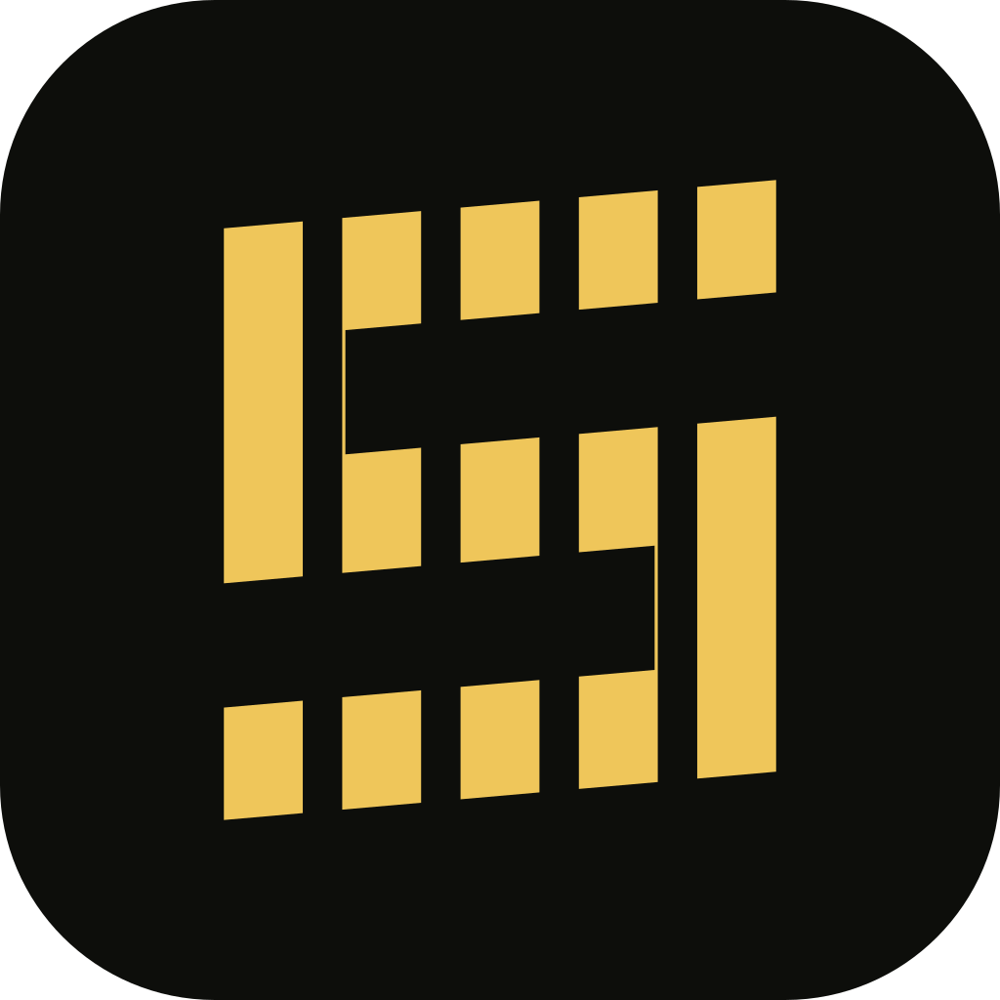

# Statusline brand assets

The official Statusline logo is the gold, vertically striped **S** from the
presentation website header. Its horizontal edges rise to the right at exactly
five degrees (`skewY(-5deg)`); the vertical edges remain vertical. It is not a
rotated or italicized S. Do not redraw it separately for individual platforms.



See the [multi-size and menu bar template review](review/README.md) for an asset
preview of the shared geometry, including the monochrome macOS exception.

## Source and regeneration

[`logo.json`](logo.json) is the single editable geometry and color source. It
preserves the original 28 × 30 CSS polygon, the 4 px filled / 2 px empty vertical
stripe pattern, the -5° vertical shear, Data Plane gold `#EFC65A`, and canvas
`#0D0E0B`. The flattened symbol has a 28 × 32.449682579 view box.

From the repository root:

```sh
npm ci --prefix branding
npm run generate --prefix branding
npm run check --prefix branding
```

The generator compiles the polygon and stripe mask into continuous, flattened
vector outlines, then renders every owned export from those same outlines.
Do not add another CSS mask, skew, rotation, or stroke to an exported symbol.
Pinned `@resvg/resvg-js` and `fflate` are development-only tools: none of the apps
or the website gains a runtime dependency. The pinned JavaScript PNG compressor
avoids host zlib differences. Fonts, network requests and operating-system icon
tools are not involved in generation.

`check` regenerates all assets in memory, compares every byte against the checked-in
exports without modifying them, and runs geometry, safe-area, transparency, image
container and stale-file tests. A source change or manually replaced icon fails
until its matching exports are regenerated. Generated brand assets are tracked;
production bundles, dependency directories and signing material are not.

## Variants and consumers

| Variant                                                                                    | Purpose                                  | Shape and color                                                                    |
| ------------------------------------------------------------------------------------------ | ---------------------------------------- | ---------------------------------------------------------------------------------- |
| [`statusline-symbol.svg`](statusline-symbol.svg)                                           | Website header/footer and reusable mark  | Tight transparent gold S, with the original shear already applied                  |
| [`statusline-icon.svg`](statusline-icon.svg), [`statusline-icon.png`](statusline-icon.png) | Repository and general presentation      | Gold S on a rounded dark square                                                    |
| [`statusline-icon-square.svg`](statusline-icon-square.svg)                                 | Platform-owned masks                     | Same gold S on an opaque, unrounded dark square                                    |
| Desktop PNG, ICO and ICNS                                                                  | Windows, Linux and macOS app/Dock icons  | Rounded dark app badge at the existing platform sizes                              |
| macOS menu bar templates                                                                   | macOS status/menu bar only               | Black silhouette on transparency; AppKit supplies the light/dark appearance        |
| Apple iOS and Android Play Store PNG                                                       | Store artwork and iOS AppIcon            | Opaque RGB square, with no alpha channel or pre-rounded corners                    |
| Android adaptive / themed vectors                                                          | Android launcher icons                   | Centered gold / white silhouette within the 66 dp safe circle of a 108 dp viewport |
| Android legacy vectors                                                                     | Android API 23–25 launchers              | Gold symbol on a full dark square                                                  |
| Web favicons and touch icons                                                               | Browser tabs, bookmarks and home screens | Multi-resolution ICO, 16/32 px PNG and opaque 180/192/512 px icons                 |

App badges center the S at 64% of the canvas height. The adaptive Android
foreground uses a 48 dp-high silhouette that fits fully inside the safe circle;
the operating system owns its outer mask. The macOS menu bar template uses a
22 × 22 px transparent canvas with a 20 px-high mark and a 44 × 44 px Retina
export. This monochrome exception must not replace the gold macOS app/Dock icon
or the Windows/Linux tray icon.

Exports live in:

- [`apps/desktop/src-tauri/icons`](../apps/desktop/src-tauri/icons): all Tauri PNG
  sizes, `app-icon.svg`, `icon.ico`, `icon.icns`, and macOS tray templates.
- [`apps/apple/statusline/Assets.xcassets/AppIcon.appiconset`](../apps/apple/statusline/Assets.xcassets/AppIcon.appiconset):
  the 1024 px iOS app icon; its square SVG source is copied to Apple store assets.
- [`apps/apple/StatuslineCompanion/Assets.xcassets/AppIcon.appiconset`](../apps/apple/StatuslineCompanion/Assets.xcassets/AppIcon.appiconset):
  the native macOS companion's 16–1024 px app icon family.
- [`apps/android/app/src/main/res`](../apps/android/app/src/main/res): legacy,
  adaptive foreground and monochrome vector resources; Play artwork is in
  [`apps/android/store/assets`](../apps/android/store/assets).
- [`apps/web/public`](../apps/web/public): favicons and touch icons, plus the shared
  symbol and square mark in `assets/`.

Website social previews are separately rendered from the tracked presentation
templates in [`apps/web/scripts/templates`](../apps/web/scripts/templates), which
reuse the generated symbol. Product/store screenshots document their capture-time
UI and are not silently repainted by this generator.

Changing these source assets does not publish a store update, rebuild installed
apps, change a GitHub organization avatar, or deploy the live website. Those
distribution steps remain separate from reproducible brand generation.
