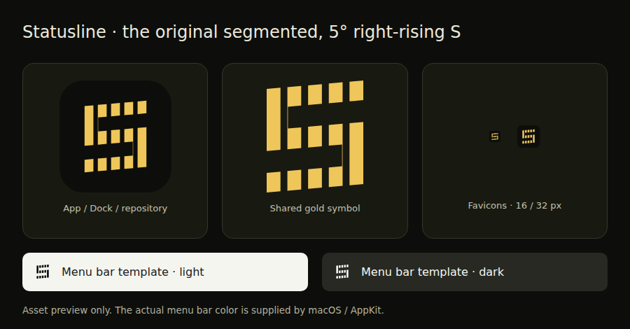

# Official logo review — 6 September 2026

This browser-rendered asset preview shows the shared gold symbol, the app badge,
16/32 px favicons, and the 22 px macOS menu bar template on light and dark
backgrounds. The white preview uses CSS inversion of the exact black template.
It is not a screenshot of macOS or evidence of an on-device native test; AppKit
supplies the actual menu bar appearance at runtime.

The original vertically segmented geometry and right-rising 5° shear are preserved.
Automated checks verify the canonical outlines, all 46 exports, icon formats and
transparency, Android safe areas, Apple catalog wiring, and the macOS-only template
configuration. Native application builds and on-device appearance checks remain
separate release steps. This review image is not shipped in any app or website build.
